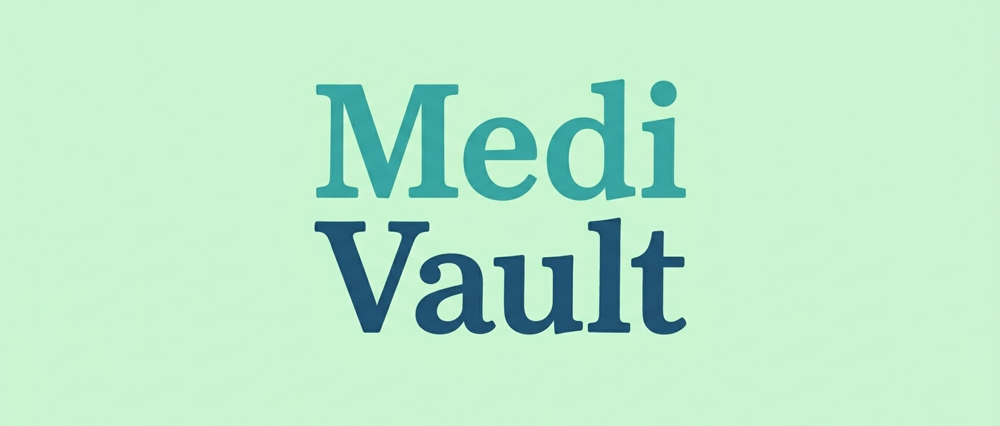

# What is MediVault?


MediVault is a secure, decentralized, peer-to-peer medical record synchronization application built for HackUPC26. It empowers patients to own their medical data while allowing doctors to securely append and share medical records without relying on centralized servers that are vulnerable to data breaches.





## Inspiration

Healthcare data has a trust problem.
Studies show that around 77% of people are willing to share their health data, but that number can crater to as low as 24% the moment it's unclear who's holding it, who can see it, or how it's being used. We wanted to build a decentralized, secure, and privacy-first solution that empowers patients to own their data and allows doctors to seamlessly communicate and share medical records without relying on a vulnerable central server.


## What it does


MediVault acts as a secure, local-first electronic medical records (EMR) application using peer-to-peer technology.


- **Role-based Workflows**: Users can choose to connect as a **Doctor** or a **Patient**.
- **Doctors**: Create a secure ledger (using Hypercore) to store patient notes. They can append notes containing subjects, detailed text, and image attachments (such as prescriptions or test results). Doctors are assigned a unique cryptographic keypair that acts as their identity, which they can export and import to seamlessly work across different devices.
- **Patients**: By using their Patient ID and their Doctor's public key, patients securely join the P2P swarm. They instantly receive their medical records directly from the doctor's node without any intermediary servers.
- **Decentralized Synchronization**: The app uses `hyperswarm` and `hypercore` to form a peer-to-peer network, ensuring that data is only shared between authorized peers.
- **Care Team Dashboard**: Patients can view all their records aggregated from multiple doctors, filtered easily using the "My Care Team" sidebar.
- **Export to PDF**: Built-in support to download medical records as a clean, formatted PDF for physical printing or external sharing.


## How we built it


We built MediVault as a desktop application using **Electron** to give users a native, installable experience.
- **Frontend**: The user interface was built using clean, responsive HTML, CSS, and vanilla JavaScript.
- **Backend/P2P**: We leveraged the Holepunch P2P stack:
 - `hypercore`: Provides secure, append-only cryptographic data structures (ledgers) for immutable medical records.
 - `hyperswarm`: Handles peer discovery and creates secure, direct connections between doctors and patients, even across different networks.
 - `b4a`: Used for handling buffers and encodings across the P2P network.


## Setup and Installation


### Prerequisites
- [Node.js](https://nodejs.org/) (v16 or higher recommended)
- npm (Node Package Manager)


### Running the application


1. Clone the repository or extract the project files.
2. Navigate to the project directory in your terminal:
  ```bash
  cd MediVault
  ```
3. Install the dependencies:
  ```bash
  npm install
  ```
4. Start the application:
  ```bash
  npm start
  ```


## Usage Instructions


### For Doctors:
1. Launch the app and select **Doctor (Create Ledger)**.
2. Enter your name and click **Initialize Secure Connection**.
3. Share the generated **Public Key** with your patients.
4. Add medical notes by entering the Patient's ID, subject, text, and optional image attachments.
5. Use **Export Keypair** to save your identity if you wish to use the same ledger on another computer.


### For Patients:
1. Launch the app and select **Patient (Join Swarm)**.
2. Enter your **Patient ID** and paste your Doctor's **Public Key**.
3. Click **Initialize Secure Connection**.
4. Your medical records will securely sync from your doctor's node and appear in your Medical Records Ledger.
5. Click **Download PDF** to save a copy of your records.
